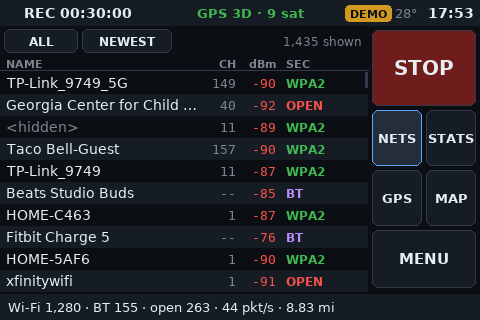
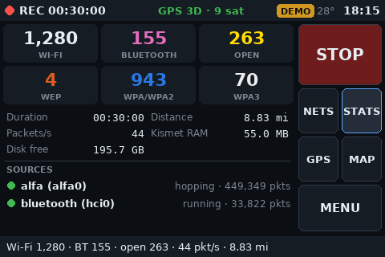
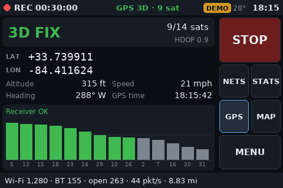
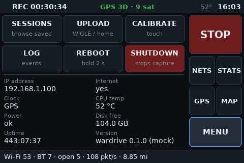
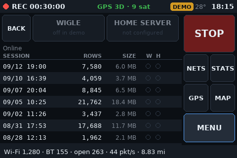
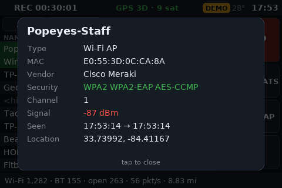

# rustypi wardriver

A self-contained, touch-driven wardriving rig built on a Raspberry Pi 4B. Power it on and
it boots straight into a full-screen touch UI on a 3.5" LCD. Tap **START** to capture Wi-Fi
and Bluetooth, watch networks scroll by with live GPS and capture stats, and tap **STOP** to
close out the session. Upload finished sessions to WiGLE or your home server from the menu.

<p>


</p>

> **Status:** alpha. Capture, GPS, Bluetooth, touch calibration and boot-to-UI work on the Pi;
> WiGLE and home-server uploads are implemented. Not yet road-tested.

---

## Hardware

| Part | Model | Role | Linux view |
|------|-------|------|------------|
| SBC | Raspberry Pi 4 Model B (2 GB) | Host | Raspberry Pi OS Lite 64-bit (Debian 13 "Trixie") |
| Wi-Fi | ALFA AWUS036ACM (MediaTek MT7612U, dual-band) | Capture radio, monitor mode | `alfa0`, pinned by driver match; in-kernel `mt76x2u` |
| Bluetooth | Pi 4 onboard radio | BT classic + BLE capture | `hci0` |
| GPS | GlobalSat BU-353N (USB) | Location + time source | `/dev/serial/by-id/usb-Prolific_…` (NMEA, 4800 baud) |
| Display | OSOYOO 3.5" HDMI LCD, 480x320, resistive touch | UI | HDMI `HDMI-A-1` + ADS7846 touch on SPI0 CE1, IRQ GPIO25 |

The onboard Wi-Fi (`wlan0`) stays in managed mode for SSH and uploads. Only the ALFA captures.

**Display wiring:** video goes over HDMI. Touch uses GPIO header pins 19–26 (SPI MOSI, MISO,
SCLK, CE0, CE1, GPIO25 IRQ, GND). The screen is powered separately, so the 5V pins aren't
needed.

**Orientation:** landscape, rotated 180° so the HDMI adapter points down.

---

## How it works

```
               ┌──────────────────────────── Raspberry Pi 4B ─────────────────────────────┐
 BU-353N ──USB─┼─► gpsd ──┬──────────────► chrony (sets system clock from GPS; no RTC)    │
               │          ├──────────────► Kismet ◄── alfa0 (monitor mode, 2.4 + 5 GHz)   │
               │          │                  │    ◄── hci0  (Bluetooth / BLE)             │
               │          │                  │  └─► /var/lib/wardrive/logs/*.kismet       │
               │          │                  │                          *.wiglecsv        │
               │          ▼                  ▼ REST API (127.0.0.1:2501)                  │
               │     ┌──────────── wardrive-ui (Python + pygame → /dev/fb0) ─┐            │
               │     │ status bar · nets · stats · gps · log · menu · upload │──► HDMI ───┼─► 3.5" LCD
               │     │ start/stop via systemd · shutdown · WiGLE/home upload │◄── SPI ────┼── touch
               │     └───────────────────────────────────────────────────────┘            │
               └──────────────────────────────────────────────────────────────────────────┘
```

- **Kismet** (from the official Kismet apt repo) does the capture work: monitor mode, channel
  hopping, BLE scanning, GPS tagging, and writing `.kismet` and WiGLE CSV logs. It runs as
  `wardrive-kismet.service`. That service isn't enabled at boot; the START button starts it.
- **gpsd** owns the GPS and polls even with no clients (`-n`), so a fix is ready before you tap
  START. **chrony** takes time from it, so log timestamps are right even with no network.
- **wardrive-ui** draws each frame off-screen with pygame, then copies it into `/dev/fb0`, the
  kernel framebuffer the text console uses. There's no X11, Wayland, or desktop. It renders a
  480x320 canvas, flips it 180°, and scales it to the HDMI mode. It reads the touch panel
  through evdev and maps coordinates with its own 4-point calibration, which covers the axis
  swap and rotation. It controls Kismet through a narrow sudoers rule.
- **systemd** starts the UI on `tty1` in place of the login prompt, about 14 s after power-on,
  and restarts it if it crashes. If the UI restarts mid-capture, it picks the running session
  back up.

### Display notes (OSOYOO 3.5" HDMI)

The OSOYOO panel reached a working setup in three steps:

| Attempt | Result | Why |
|---|---|---|
| Force native `480x320` | "No Signal" | 60 Hz at that size needs an 11.9 MHz pixel clock; HDMI's minimum is 25 MHz |
| Force `640x480` | Signal, but black | The panel lists it in its EDID but doesn't display it |
| **No forced mode** | ✅ Works | The Pi uses the panel's preferred **1280x720**, and the panel's scaler shrinks it to 480x320 |
| SDL straight to DRM/KMS | Black | The UI's buffer reached the display but never showed (likely its alpha channel) |
| **Copy frames into `/dev/fb0`** | ✅ Works | The same opaque buffer the text console uses |

Rotation uses `fbcon=rotate:2`, which flips only the console text. `video=…,rotate=180` would
also rotate everything drawn on the screen, and the app already flips its own frames.
`scripts/display-test.sh` checks each display path one at a time if you change screens.

---

## The UI

| | |
|---|---|
|  |  |
|  |  |

*(Screenshots use simulated data.)*

| View | Shows |
|------|-------|
| **NETS** | Live list of Wi-Fi APs and Bluetooth devices. Filter ALL/WIFI/BT; sort newest or strongest. New devices flash green. Tap a row for details. Drag to scroll. |
| **STATS** | Wi-Fi, BT, and per-security counts, duration, distance, packets/s, Kismet RAM, free disk, capture source health. |
| **GPS** | Fix type, satellites, HDOP, lat/lon, altitude, speed, heading, GPS time, clock source. |
| **LOG** | App and Kismet events (source errors, GPS fix gained or lost, start/stop). Tap for full text. |
| **MENU** | UPLOAD, CALIBRATE touch, REBOOT and SHUTDOWN (hold 2 s), IP address, internet, power, temp, disk. |
| **UPLOAD** | Finished sessions with GPS row counts and upload state; one button each for WiGLE and your home server. |

The status bar shows recording time, GPS fix and satellites, CPU temp, a `PWR!` warning for
under-voltage or throttling, and the clock. The footer shows live totals, the last session,
or errors.

---

## Setup

### 1. Flash the Pi
Raspberry Pi OS **Lite** (64-bit). No desktop is needed. In Raspberry Pi Imager, set the
hostname, user, Wi-Fi, SSH key, and Wi-Fi country.

### 2. Deploy from a dev machine
```bash
git clone git@github.com:rcland12/wardriving.git && cd wardriving
./scripts/deploy.sh rustypi7 --boot --reboot
```
Or run it on the Pi from a clone:
```bash
sudo ./scripts/install.sh && sudo ./scripts/boot-config.sh && sudo reboot
```

`install.sh` is idempotent. It does the following:

1. Installs gpsd, chrony, pygame, evdev, `libdrm-tests` (for `display-test.sh`), and Kismet
   (`kismet-core` plus the linux-wifi and linux-bluetooth capture helpers) from Kismet's repo.
2. Pins the ALFA as `alfa0` and tells NetworkManager to leave it alone.
3. Configures gpsd for the GPS and adds it to chrony as a time source.
4. Writes `/etc/kismet/kismet_site.conf`, creates `/var/lib/wardrive/logs`, generates Kismet
   REST credentials in `~/.kismet/kismet_httpd.conf`, and unblocks Bluetooth.
5. Installs `wardrive-kismet.service`, the sudoers rule, `/opt/wardrive`, and
   `/etc/wardrive/wardrive.toml` (created from the example only if it doesn't exist yet).
   Then it enables `wardrive-ui.service`.

`boot-config.sh` edits `/boot/firmware` and keeps timestamped backups. It's idempotent, and
`--remove` undoes it:

- **`config.txt`:** `dtparam=spi=on`, the `ads7846` touch overlay (`cs=1`, `penirq=25`), and
  `disable_splash=1`
- **`cmdline.txt`:** `fbcon=rotate:2` (console upside-down to match the mount), hidden cursor,
  no console blanking, quiet boot. No `video=` mode is forced (see
  [Display notes](#display-notes-osoyoo-35-hdmi)). Options:
  `WARDRIVE_QUIET=0` shows boot messages, and `WARDRIVE_HDMI_MODE` forces a mode.

### 3. First boot: calibrate touch
With no calibration saved, the UI opens the calibration screen. Tap the four corner
crosshairs, then the center one to verify. Use the stylus. Then tap around the test pad and
hit DONE. The calibration is saved to `~/.config/wardrive/touch.json`. To redo it later, go
to **MENU → CALIBRATE**.

### 4. Configure uploads (optional)
Edit `/etc/wardrive/wardrive.toml` on the Pi. It's readable only by root and your user, and
is never committed. See [`config/wardrive.toml.example`](config/wardrive.toml.example).
```toml
[upload.wigle]
enabled = true
api_name = "AID..."        # from https://wigle.net/account
api_token = "..."

[upload.home]
enabled = true
url = "https://api.example.com/wardrive/upload"

[upload.home.headers]      # Cloudflare Access service token for this Pi only
CF-Access-Client-Id = "<id>.access"
CF-Access-Client-Secret = "<secret>"
```
Then check the credentials without uploading anything, and restart the UI:
```bash
cd /opt/wardrive && python3 -m wardrive --test-upload
sudo systemctl restart wardrive-ui
```

The home upload gzips each `.kismet` and `.wiglecsv` file and POSTs it to the
`/wardrive/upload` endpoint of your home API, which stores it under
`api/data/wardrive/<session>/`. Files must be under 95 MB after compression, because of
Cloudflare's body limit. Re-sending an identical file is harmless.

---

## Using it

1. Power on the screen and the Pi together. Put the GPS where it can see the sky.
2. Tap **START**. Until the clock is set from GPS, the button shows **CANCEL / for GPS time**
   and the status bar shows **GPS TIME…**. Capture starts as soon as the time is set, so every
   record has a correct timestamp. At home on Wi-Fi, it starts immediately.
3. Drive, then tap **STOP**. Kismet closes its logs, and a session summary pops up.
4. **MENU → hold SHUTDOWN** before cutting power. If a capture is still running, it's stopped
   cleanly first.
5. At home on Wi-Fi, go to **MENU → UPLOAD → HOME SERVER** to archive the session, then review
   and publish it from the server (below).

Get logs directly (never deletes anything):
```bash
./scripts/pull-logs.sh rustypi7      # -> ./logs/ (gitignored)
```

### Review, repair, then publish to WiGLE

Sessions go to your own server first, and nothing reaches WiGLE until you've reviewed it.
`tools/wardrive_review.py` (standard library only) works on the server's session directory:

```bash
tools/wardrive_review.py list                 # sessions and status
tools/wardrive_review.py check latest         # validate; exit code 1 on problems
tools/wardrive_review.py fix latest           # write review/<session>.wiglecsv (originals untouched)
tools/wardrive_review.py wigle latest --dry-run
tools/wardrive_review.py wigle latest         # upload the reviewed file; refuses on FAIL or re-upload
tools/wardrive_review.py wigle-status         # WiGLE processing status
```

`check` looks for:
- **Clock changes mid-capture.** Stale and correct FirstSeen times get grouped into clusters,
  and the offset is measured to ±1 s from the Kismet database's packet order.
- **Wrong security type.** Each row is compared with what Kismet recorded for that BSSID.
- Rows without coordinates, implausible times, GPS jumps, and duplicates.

`fix` shifts (or, with `--drop-stale`, removes) rows with the wrong time, rebuilds AuthMode
from the database, and removes duplicates.

> **Kismet 2025.09 bug:** its live WiGLE CSV writer leaves out WPA/RSN details (every network
> looks open) and marks every encrypted network as WPS. The Kismet database has the correct
> values, and `fix` rebuilds them from it. Always run `fix` before uploading.

Settings are in `~/.config/wardrive/review.env` (`chmod 600`):
```
WARDRIVE_DATA=/path/to/api/data/wardrive
WIGLE_API_NAME=AID...        # wigle.net → Account → API Name
WIGLE_API_TOKEN=...          # API Token (not "Encoded for use")
WIGLE_DONATE=on              # allow WiGLE commercial use of your uploads
```
With this setup, leave `[upload.wigle]` on the Pi unconfigured.

---

## Development

The UI runs anywhere pygame does, using a simulated backend:

```bash
source ~/.global_venv/bin/activate
pip install pygame requests pytest
python -m wardrive --mock --window                # desktop window, mouse = touch
python -m wardrive --screenshot docs/images       # render every screen to PNG (headless)
python -m pytest -q tests                         # calibration, parsing, uploads, UI dispatch
./scripts/deploy.sh --ui-only                     # sync UI code to the Pi and restart it
```

On the Pi:
```bash
journalctl -u wardrive-ui -f                      # UI log
journalctl -u wardrive-kismet -f                  # capture log
sudo systemctl kill -s USR1 wardrive-ui           # save the live screen to /tmp/wardrive-screen-<view>.png
cgps                                              # GPS sanity check
sudo evtest /dev/input/by-path/*spi*              # raw touch events
chronyc sources                                   # is GPS feeding the clock?
```

### Repository layout
```
wardrive/            touch UI package (python3 -m wardrive)
  app.py             main loop, frame (status bar / nav / footer), modals
  backend.py         Kismet service control + REST polling -> State
  kismet.py gps.py sysinfo.py uploads.py
  touch.py           evdev reader + affine calibration
  display.py theme.py widgets.py fmt.py state.py config.py mock.py
  views/             nets, stats, gps, log, menu, upload, calibrate
config/              kismet_site.conf, wardrive.toml.example
system/              systemd units, sudoers, NetworkManager/chrony/link files
scripts/             install.sh, boot-config.sh, deploy.sh, pull-logs.sh, display-test.sh
tools/               wardrive_review.py (server-side review, repair and WiGLE upload)
tests/               hardware-free tests
docs/images/         screenshots (simulated data)
```

---

## Troubleshooting

| Symptom | Check |
|---------|-------|
| Screen upside down | Set `display.rotate` in `wardrive.toml` (0 or 180) and `WARDRIVE_ROTATE` for `boot-config.sh`, then recalibrate |
| Touch lands in the wrong place | MENU → CALIBRATE. If you can't reach the menu: `rm ~/.config/wardrive/touch.json && sudo systemctl restart wardrive-ui` |
| No touch device | `grep -A4 ADS7846 /proc/bus/input/devices`. Try `WARDRIVE_TOUCH_CS=0 sudo ./scripts/boot-config.sh` |
| "No Signal" | Remove any forced mode: `sudo ./scripts/boot-config.sh` (don't set `WARDRIVE_HDMI_MODE`). Check the pixel clock: `sudo grep 'mode: "[0-9]' /sys/kernel/debug/dri/*/state` (second number, kHz, must be ≥ 25000) |
| Signal but black UI | Console visible when the UI is stopped? Run `sudo PHASES="C D E" ./scripts/display-test.sh` and watch which phases appear. Keep `display.backend = "fbdev"` |
| Screen dead after boot changes | `sudo ./scripts/boot-config.sh --remove && sudo reboot` restores the original boot files |
| GPS NO FIX forever | Get a sky view (it won't lock indoors). Check `cgps` |
| Bluetooth source error | `sudo rfkill unblock bluetooth` |
| START → ERROR | LOG view, then `journalctl -u wardrive-kismet -b` |

---

## Legal and privacy

- Passive collection of broadcast beacons is generally legal in the US. Don't connect to,
  deauth, or attack networks you don't own. Check your local laws.
- Capture logs contain precise location history and nearby device identifiers. `logs/` and
  capture file types are gitignored. **This repo is public: keep it that way.**
- Kismet REST credentials and upload tokens live only on the Pi.

---

## License

[MIT](LICENSE) © 2026 Russell Land

This project installs and talks to other software but doesn't include its code. Those
projects keep their own licenses: [Kismet](https://www.kismetwireless.net/) (GPL-2.0, run as
a separate service over its REST API), gpsd (BSD-2-Clause), chrony (GPL-2.0), and pygame
(LGPL-2.1).
