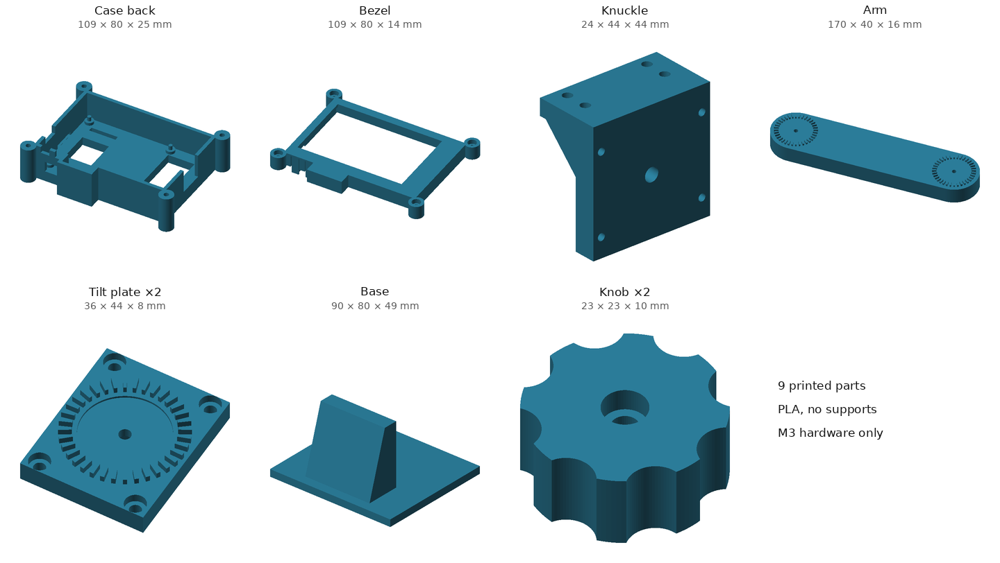

# Case and dash mount

A 3D-printable enclosure and articulated car-console mount for the wardriver: a
Raspberry Pi 4B with the OSOYOO 3.5" HDMI touch screen on top. It's designed around
those exact boards, including the screen's glass border, its rigid HDMI adapter and
its two side buttons, so it fits this stack specifically.



- **9 printed parts** (7 designs; the tilt plate and knob are printed twice), PLA,
  **no supports**
- **M3 hardware only**, no screws into the Pi
- Two **10°-step toothed tilt joints**: one leans the arm to cancel the console's
  slope, the other tilts the screen
- Flex buttons in the bezel reach the screen's PWR and backlight buttons
- Every part is generated by `scripts/fusion_build.py`, so a changed measurement
  rebuilds the whole model

Back to the [main project](../README.md).

---

## The build

Screen facing you, landscape, GPIO edge up, cables out the bottom (the HDMI adapter
points down, matching the software's 180° rotation):

```
                    GPIO header edge (up)
      +-------------------------------------------------------+
      |  +-------------------------------------------------+  |
 LCD  |  |                                                 |  |  USB-A: GPS +
power |  |          3.5" screen (lit area)                 |  |  Wi-Fi adapter,
 cord |  |                                                 |  |  both in the
 <==  |  +-------------------------------------------------+  |  blue USB3 stack
SD    |                                                       |  ==>
slit  +--[PWR]-[BKL]------+=================+-----------------+
         flex buttons     |  adapter hood   |
         (bottom face)    +=================+
       Pi power cord exits down
                              |
                      [ tilt joint ]   10° steps, tilts the screen up/down
                              |
                          206mm arm
                              |
                      [ tilt joint ]   leans the arm, cancels console slope
                      [ base plate ]   3M VHB to the console
```

Reference photos of the Pi + screen stack the case was measured from are in
[`images/`](images).

---

## Parts

| Body | Qty | Size (mm) | Print orientation | Notes |
|---|---|---|---|---|
| `01_case_back` | 1 | 108.6 × 79.6 × 25.4 | back face down | Pi pocket, port openings, open back, 23 vent slots, 4 corner ears, adapter hood |
| `02_case_bezel` | 1 | 111.3 × 79.6 × 22.0 | **flip: front face down** | 9.5 thick; flex-button tabs hang 4.1 below it; stylus tube at top-left reaches 22 back from the face |
| `03_tilt_plate` | **2** | 36 × 44 × 7.8 | teeth up | One on the case, one on the base |
| `04_arm` | 1 | 246.2 × 40 × 15.8 | **lying flat, rotated 45° on the bed** | Toothed hub at both ends. Too long to lie straight on a 225 mm bed |
| `05_base` | 1 | 90 × 80 × 49 | plate down | Buttressed wall with a vertical mounting face |
| `06_knob` | **2** | 23.3 × 23.3 × 10 | head pocket up | Tilt bolt's head presses into it |
| `07_knuckle` | 1 | 24 × 44 × 44 | **flip: foot down** | Turns the top joint so it tilts the screen |

The shell itself is 93.6 × 64.1 mm; the sizes above include the corner ears and the
adapter hood (a 25.7 × 8 mm bump on the bottom edge). The assembled case is 34.9 mm
thick. Expect roughly 190–220 g of PLA at the settings in the print guide.

| Files | Use |
|---|---|
| [`models/stl/`](models/stl) | One STL per part, for any slicer |
| [`models/3mf/`](models/3mf) | The same parts as 3MF (geometry only) |
| [`models/step/`](models/step) | The whole design as STEP, editable in any CAD tool |
| [`models/f3d/`](models/f3d) | Fusion 360 archive of the parametric model |

---

## Printing

**Full guide: [`docs/PRINTING.md`](docs/PRINTING.md)**: settings, per-part
overrides, print order and post-processing. The short version:

- PLA, 0.4 mm nozzle, 0.2 mm layers, **4 walls**, 5 top/bottom layers, 25 % gyroid,
  **supports off**
- Only two parts need turning over on the bed: the **bezel** goes front face down,
  the **knuckle** goes foot down
- Set **line width 0.40 mm on the bezel** so its 1.2 mm flex buttons print as exactly
  three lines
- **Print the bezel first** and dry-fit it on the screen. It has the tightest
  tolerances, so any problem turns up after 12 g of plastic instead of 200 g

Built and tested on an Elegoo Neptune 3 Pro with Cura. Sliced G-code isn't included,
because it only works on the printer and profile it was sliced for.

---

## Hardware (M3 only)

| Qty | Item | Where | Why this length |
|---|---|---|---|
| 4 | **M3 × 30 socket head** + nut | Bezel to back shell | Heads sit in Ø5.9 × 3.2 mm recesses in the bezel. Nut pockets are sunk 5.1 mm, so a 30 mm screw passes fully through the nut and stops 1 mm past it |
| 8 | **M3 × 8** | Knuckle foot to case back (4), top tilt plate to knuckle (4) | 4.5 mm of thread each; a longer screw bottoms out in the case floor |
| 4 | **M3 × 12** | Base tilt plate to base wall | Tapped 10 mm deep, giving 8.5 mm of thread |
| 2 | **M3 × 30 socket head** + nut + flat washer | Tilt bolts | Head pressed into the knob, nut captured in the tilt plate, washer between knob and arm |
| ~30 cm | Single-sided closed-cell foam tape, ~1 mm thick, cut into ~1.5 mm strips | Bezel lip, around the window | Fills the 0.5 mm gap so the screen can't rattle, without clamping the glass |
| — | 3M VHB tape (4991 for textured plastic) | Base to console | |

**No lock washers anywhere.** On screws threaded into plastic they bite in and the
plastic creeps, so they don't lock and can crack the part. The flat washers under the
knobs only stop tightening from grinding the arm.

---

## Assembly

1. Form the threads: run an M3 screw slowly into each tapped hole and back out (four
   in the case floor, four in the knuckle's upright, four in the base wall).
2. Press four M3 nuts into the hex pockets on the back face of the case back's corner
   ears, then lay the case back on its back. The table keeps the nuts in place while you
   work, and the hex shape stops them turning, so you never need a wrench on them.
3. **Remove the microSD card.** Plug the screen onto the Pi and lower the pair into
   the case back: the four pegs go into the Pi's mounting holes and the HDMI adapter
   drops into the hood.
4. Stick foam strips around the underside of the bezel's window lip, adhesive side on the
   bezel. Keep them on the lip and out of the window: the glass border is only 1.6 mm on
   the top edge.
5. Lower the bezel on. The two flex tabs slide into the notches in the bottom wall and
   the cap closes over the hood.
6. Drive four M3 × 30 through the bezel into the nuts (2.5 mm hex key), a few turns each
   in a criss-cross order. Stop when the bezel meets the case back all the way round and
   the screws are snug. Don't crank them: PLA ears crack and nuts get pulled out of their
   pockets. If a nut spins or pushes out, hold it with a fingertip from below, or fix it
   with a drop of CA glue. If the seam won't close without force, the foam is too thick.
7. **Test the buttons:** press each tab on the bottom face; you should feel the
   screen's button click.
8. Push the microSD card back in through the slit on the left side.
9. Press an M3 × 30's head into each knob's round pocket. If it's tight, warm the
   screw head for a few seconds with a soldering iron and push it in.
10. Bolt `07_knuckle` to the case back through its foot (4× M3 × 8, driven down the
    tunnels in the gusset).
11. Drop a nut into the centre hex pocket of each tilt plate. Bolt one plate to the
    knuckle's upright with its long side along the case height (4× M3 × 8), and the
    other to the base wall with its long side along the base (4× M3 × 12). The nuts
    end up trapped.
12. At each joint: flat washer on the knob's bolt, then through the arm into the
    plate's nut. **Rotate the plate half a tooth (5°) against the arm so the teeth
    interleave.** Square-on they sit tip-to-tip and won't seat. Set the angle, then
    tighten.
13. Clean the console with isopropyl alcohol and stick the base down with VHB. The arm
    leans along the base's **long side** (90 mm), so point that side where you want
    the screen to face.

---

## How it's designed

### The screen is held by its glass border, through foam

In a car, the main risk is the GPIO header slowly walking off its pins under
vibration. So the whole screen + header + Pi sandwich is clamped between the bezel and
the back shell, bolted with 4× M3 that pass **outside** both boards.

The glass covers nearly the whole screen board (84.13 × 54.82 mm on an 85 × 56 board),
so there's no bare PCB for the bezel to press on. The bezel lip lands on the **glass
border** instead, outside the lit area, with at least 1.6 mm of border on every side
(2.0 left, 7.7 right, 3.3 bottom, 1.6 top). The pocket leaves 0.5 mm for a strip of
thin foam, so the screen is held firmly without the lip pressing hard on the glass.
Heavy pressure on a resistive touch panel can cause phantom touches.

**The Pi has no screws.** Its mounting holes are 2.75 mm and an M3 won't pass, so it
sits on four locating pegs and the bezel clamps it through the screen.

### The HDMI adapter gets its own hood

The rigid adapter reaches 10.34 mm past the Pi's edge, well beyond a normal wall.
Instead of making the whole case taller, a local hood on the bottom edge encloses just
the adapter with 0.6 mm clearance, and the bezel carries a matching cap. The rest of
the case keeps its normal size, with a near-even border around the screen.

### PWR and BKL are flex buttons built into the bezel

The screen's two buttons sit on its bottom edge, about 2.4 mm inside the case wall.
Each gets a 5 mm-wide tab cut into the bezel's bottom wall: flush with the outside,
hinged at the bezel face, hanging just past the seam into a notch in the case back. A
small wedge on its inside sits 0.3 mm from the button. Press the tab and it flexes,
and the wedge pushes the button.

The tabs are in the bezel rather than the case back because the Pi's power-cord
opening sits directly below BKL in the case-back wall, leaving no room for a tab long
enough to flex safely in PLA. BKL is only 3.4 mm from the HDMI adapter, so its tab is
shifted 0.74 mm away from the hood while its wedge stays on the button. The build
script refuses to run if a wedge can't cover a button's centre by at least ±0.75 mm.

### Ventilation

The Pi's processor faces the screen, so it sits in the 16 mm gap between the Pi and the
LCD — the hot pocket. The open back only vents the underside of the Pi's circuit board,
which blocks that air from the processor, so the vents go through the **walls, at the
height of that gap**: 23 vertical slots, 3 mm wide, about 1030 mm² of opening.

| Wall | Slots | Notes |
|---|---|---|
| Top (GPIO edge) | 13 | Mounted, this edge faces up: the exhaust |
| Bottom (power edge) | 6 | Right of the adapter hood: the intake. The rest of that wall is the power jack, button notches and hood |
| Left | 4 | Between the LCD power notch and the stylus tube, above the SD slit |
| Right | 0 | The USB2 stack and ethernet jack sit against it inside; the USB3 notch is already open |

With the GPIO edge up and the power edge down, hot air rises through the gap and out the
top — a chimney.

**Structure is protected by rules the build enforces:** at least 3 mm of solid rib
between slots and around every existing opening, a 2 mm solid band along the floor and the
rim (the bezel clamps down on the rim), 8 mm of solid wall at each corner (the ears carry
the bezel screws), and **no slots in the floor**, which carries the whole mount's weight
through the knuckle. Slots are vertical so each one only bridges its 3 mm width when the
case back prints.

### Stylus holder

A round tube just outside the bezel's top-left edge, below the corner ear, with its axis
perpendicular to the screen and its front flush with the screen face. Drop the stylus in
tip-first and it hangs on its paddle, which can't pass the 5.2 mm bore. The tube reaches
22 mm back from the face — past the bezel and alongside the case back with a 0.8 mm gap —
so the stylus stays straight.

The bore prints at about 5.0 mm, a snug slip fit on the 4.88 mm barrel. If the stylus
still walks out on bumps, drop `stylus_bore` to 5.1; if it won't go in, raise it to 5.3.
Either way it's a bezel reprint only. The
stylus sticks out behind the case but runs well clear of the arm at every tilt angle,
checked by `mountcheck` assuming a 110 mm stylus.

### Ports

| Opening | Where | Sized for |
|---|---|---|
| Pi power (USB-C) | bottom face | a USB-C plug overmold of 10.92 × 6.17 mm |
| Screen power (USB-C) | left side, high | the same plug size |
| USB-A | right side | the blue USB3 stack with 16.5 mm plugs (GPS and Wi-Fi adapter). `usb2_open = 1` opens the USB2 stack too |
| microSD | left side slit | card inserted after the Pi is in |
| Ethernet, AV, micro-HDMI | closed | not used |

### Why the arm prints flat

A cantilevered arm in a car is a vibration lever loaded fore and aft. Printed upright,
every layer boundary at its base is in tension, and that's where it snaps. Printed
flat, the layer lines run along the load path. That's also why it's a 40 × 14 mm fin
rather than a round post: the 40 mm side faces the bending load, and the flat profile
lets it lie on the bed with both toothed hubs facing up.

### Two tilt joints

Both ends of the arm carry the same joint: 36 teeth on a Ø34 hub, **10° steps**. The
teeth sit in a band from 13.5 to 17 mm radius, far enough out that every tooth and gap
is at least two extrusions wide.

Both bolts are horizontal and **parallel to the screen's long edge**, like a desk lamp:

- The **base joint leans the arm** toward or away from the direction the screen faces.
  That also cancels the console's slope, so no wedge is needed.
- The **top joint tilts the screen** up and down. The screen always stays level in
  landscape.
- **The screen faces the direction the arm leans.** Lean the arm L degrees and set the
  top joint to the same L, and the screen stands upright facing along the lean. That's
  checked collision-free for every lean from 0° to 90°.

The top joint connects through `07_knuckle`, an L-bracket that holds the joint 23 mm
behind the case, so the arm's rounded end clears the case at every angle. From upright,
the screen can tilt 180° before the arm would hit the case back.

The bolt only provides clamping force; the teeth carry the load. So M3 is plenty, and a
positive tooth lock can't creep the way a friction joint does. Braking at 1 g with
a ~250 g payload at ~234 mm is about 0.6 N·m, or ~38 N spread over 36 teeth.

| | mm above console floor |
|---|---|
| Base pivot | 28 |
| Top pivot, arm vertical | 234 |
| Case bottom face, arm vertical, screen upright (where the power cords exit) | ~202 |

Leaning the arm lowers everything: the top pivot sits at 28 + 206 × cos(lean) mm.

---

## Customizing

All geometry and parameters live in one file, [`scripts/fusion_build.py`](scripts/fusion_build.py).
The most useful parameters in its `PARAMS` table:

| Parameter | Default | Effect | Reprint |
|---|---|---|---|
| `arm_h` | 206.2 mm | Arm length, pivot to pivot. Every 10 mm added raises the cord exit by 10 mm | arm only |
| `stylus_bore` | 5.2 mm | Stylus tube bore. Smaller = firmer grip on the 4.88 mm barrel | bezel only |
| `vent_w` / `vent_rib` | 3 mm / 3 mm | Vent slot width and the solid rib between slots. Slot count adjusts automatically | case back only |
| `nub_gap` | 0.3 mm | Flex-button wedge to button. Lower it if a button doesn't click, raise it if one is held down | bezel only |
| `adp_hood` | 1 | 0 = open notch instead of a hood (the adapter then pokes ~5 mm out of the case) | case back, bezel |
| `usb2_open` | 0 | 1 = also open the USB2 port stack | case back |

Without Fusion 360, import the STEP file into any CAD tool to modify a part.

### Rebuilding the model

`fusion_build.py` is written as numbered stages of Fusion 360 API Python. `scripts/push.py`
sends them to a Fusion add-in that runs scripts received over HTTP (set
`FUSION_BRIDGE_URL`; the add-in isn't part of this repo), then runs the built-in checks:

```bash
python scripts/fusion_build.py --list          # stages
python scripts/push.py status
python scripts/push.py reset params 01 02 03 04 05 06 07 verify fitcheck mountcheck save
```

- `verify` fails on missing or extra bodies, overlaps, or invalid geometry
- `fitcheck` puts the case back and bezel in their **assembled** positions and checks
  them against stand-ins for the real hardware (Pi, ports, cable plugs, screen, glass,
  adapter, SD card, buttons). It then presses each flex button to confirm the wedge
  lands on the button, and checks every screw length against its nut or tapped hole
- `mountcheck` swings both tilt joints through their range in 10° steps and checks the
  arm against the base, knuckle, case and bezel at every step
- Every push is logged to `logs/build_log.jsonl` (git-ignored) with the sha256 of the
  exact code sent

The stages are wrapped for that add-in's execution scope, not for Fusion's own script
runner (which expects a `run(context)` entry point). Without the add-in, work from the
F3D or STEP file instead.

`MEASUREMENTS.yaml` is the caliper sheet the parameters came from;
`scripts/sync_params.py` reports which entries are verified. After changing the
design, re-export the meshes into `models/` and regenerate the preview with
`python scripts/render_parts.py`.

---

## Risks

**PLA in a car.** PLA softens around 60 °C, and a closed car in the sun gets well past
that. The arm is the part most likely to droop, since it's cantilevered and always
loaded, and it's also the cheapest to reprint. If it sags after a hot week, reprint
just the arm in PETG; nothing else needs to change.

**Cord reach.** The arm is now 206 mm pivot to pivot. With it vertical and the screen
upright, the power cords leave the case about 202 mm above the console, leaving roughly
103 mm of a 305 mm cord for the run to the socket — tight. Leaning the arm recovers it:
about 122 mm spare at 25° from vertical, 222 mm at 65°. You need two sockets (Pi and LCD).

**Flex buttons in PLA.** The tabs are sized for occasional presses. If one cracks,
reprint the bezel; PETG makes them tougher.

**Touch panel pressure.** If you see phantom touches along the screen edge, the foam is
too thick or too firm; a thinner strip fixes it.

**VHB on textured console plastic** bonds poorly without prep. Clean with isopropyl
alcohol; 3M 4991 is the grade for low-surface-energy plastics.

---

## Files

```
case/
├── README.md                  this guide
├── docs/PRINTING.md           slicer settings, orientations, print order, post-processing
├── MEASUREMENTS.yaml          caliper sheet the parameters were built from
├── images/                    parts preview + reference photos of the Pi/screen stack
├── models/
│   ├── stl/                   one mesh per part (print these)
│   ├── 3mf/                   same parts as 3MF
│   ├── step/                  whole design, neutral CAD
│   └── f3d/                   Fusion 360 archive
└── scripts/
    ├── fusion_build.py        all geometry + parameters (single source of truth)
    ├── push.py                sends stages to a Fusion add-in, logs every push
    ├── sync_params.py         which measurement-sheet values are verified
    ├── fusion_lib.py          shared Fusion API preamble (mm-to-cm helpers)
    └── render_parts.py        regenerates images/parts.png from the STLs
```
